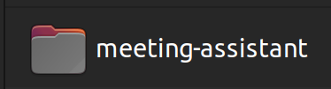
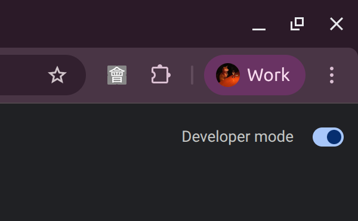
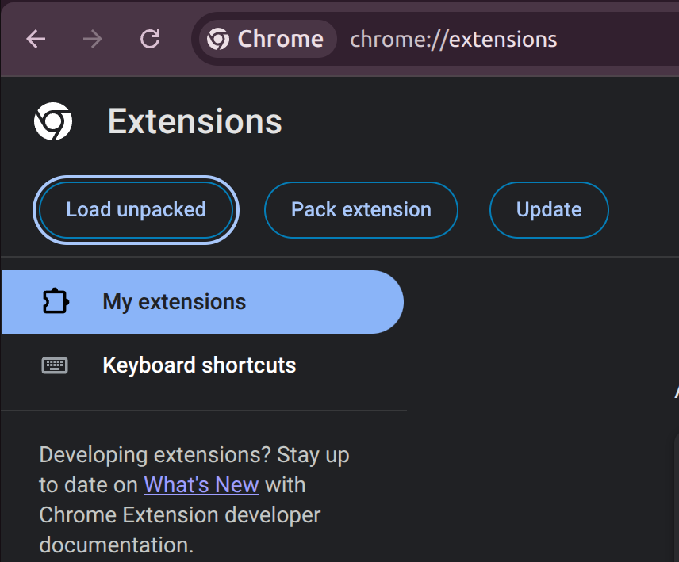
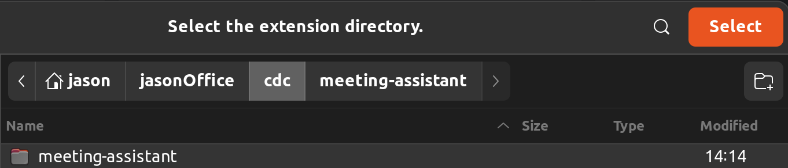
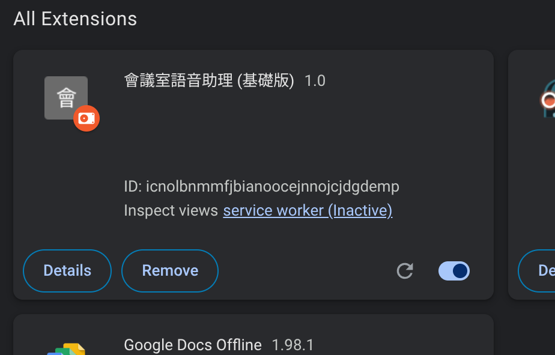
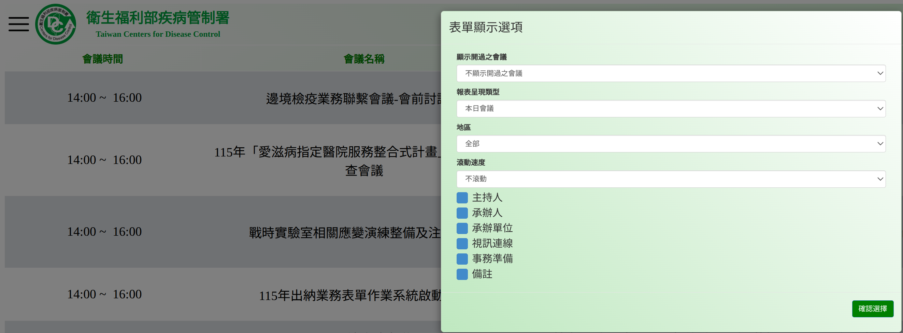
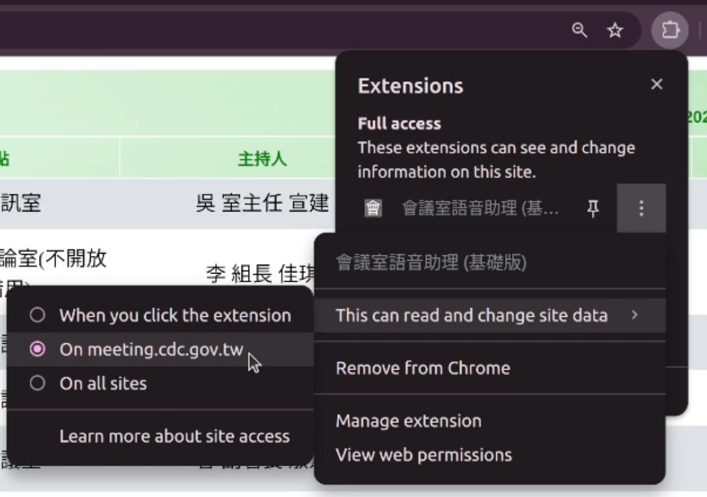
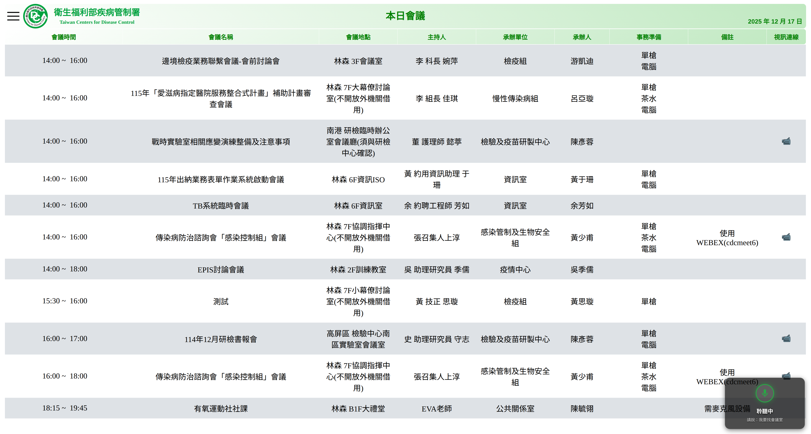

# 🎙️ 會議室語音查詢助手 (Meeting Room Voice Assistant)


這是一個專為 CDC 內部會議系統設計的 Chrome 擴充功能。透過 **Web Speech API** 實現語音控制，讓使用者能以免持方式快速查詢會議資訊、地點、時間，並支援模糊搜尋與特定事項（如：茶水）篩選。

## ✨ 主要功能

- **🗣️ 語音喚醒與控制**：
  - 支援自然語言指令，例如：「幫我找李組長」、「查詢七樓會議室」。
  
- **🔍 智慧模糊搜尋**：
  - 整合 `pinyin-pro` 套件，支援 **中文拼音模糊比對**（即使發音不標準也能找到）。

- **☕ 特定事項篩選**：
  - 支援關鍵字偵測（如：「茶水」、「事物準備」），快速過濾出有提供茶水的會議。

## 🛠️ 技術架構

- **JavaScript (ES6+)**：核心邏輯。
- **Web Speech API**：`webkitSpeechRecognition` (語音轉文字) & `SpeechSynthesisUtterance` (文字轉語音)。
- **[pinyin-pro](https://github.com/zh-lx/pinyin-pro)**：輕量級中文轉拼音工具，用於強化搜尋精準度。
- **Chrome Extension Manifest V3**：符合最新的擴充功能規範。

## 🚀 安裝說明

由於本工具為內部使用，未上架 Chrome 商店，請依照以下步驟安裝：

1.  **下載專案**：將本專案資料夾下載至電腦：

    <div align="center">
        
    </div>
    <br>
2.  **開啟擴充功能管理頁面**：
    - 在 Chrome 瀏覽器網址列輸入 `chrome://extensions/`。
    <br>
3.  **開啟開發人員模式**：
    - 點擊右上角的「開發人員模式 (Developer mode)」開關。
    <div align="center">
        
    </div>
    <br><br>

4.  **載入擴充功能**：
    - 點擊左上角的「載入未封裝項目 (Load unpacked)」。
    <div align="center">
        
    </div>
    <br>

    - 選擇本專案的資料夾。
    <div align="center">
        
    </div>
    <br>

    - 在All Extensions會看到會議室語音助理 (基礎版) 1.0，請打開它右下角的開關。
    <div align="center">
        
    </div>
    <br><br>
5.  **進入會議網頁**：
    
    點選會議網址：https://meeting.cdc.gov.tw/Meeting/Meeting ，側邊選單點開來記得把滾動速度調整成『**不滾動**』。
    <div align="center">
        
    </div>
    <br><br>
    
    開啟右上角的拼圖圖示：
    
    1. 點選會議是語音助理右側的三點
    2. 點選『This can read and change site data』
    3. 點選『On meeting.cdc.gov.tw』
    <div align="center">
        
    </div>

    4. 若是有跳出是否開啟麥克風權限，選『Allow』
    <br><br>

6. **完成！** 回到會議系統頁面重新整理即可使用(右下角會顯示小助手視窗，請用滑鼠點一下啟用)。
    <div align="center">
        
    </div>

## 📖 使用指南

### 1. 喚醒助手
點擊畫面右下角的麥克風圖示，或直接對著麥克風說：
> 「我要找會議室」

### 2. 語音指令範例
當助手進入「請說出會議地點或關鍵字」狀態時，你可以說：

| 查詢類型 | 語音指令範例 | 說明 |
| :--- | :--- | :--- |
| **找人名** | 「署長」、「陳佳何」 | 盡量講大聲、清楚 |
| **會議名稱**| 「EPIS討論會議」、「傳染病防治」| 不用完整說出來，會找關鍵字 |
| **找地點** | 「七樓會議室」、「10樓」 | 自動轉換樓層數字 |
| **找時間** | 「早上十點半的會」、「下午兩點」 | 自動過濾前後 10 分鐘的會議 |
| **找事項** | 「茶水」、「電腦」 | 篩選有填寫茶水或是電腦的會議 |

## 📂 專案結構

```text
.
├─ README.md            # 專案說明文件
├─ background.js
├─ content.js           # 主要邏輯
├─ manifest.json        # 擴充功能設定檔
└─ pinyin-pro.js        # 拼音套件
```